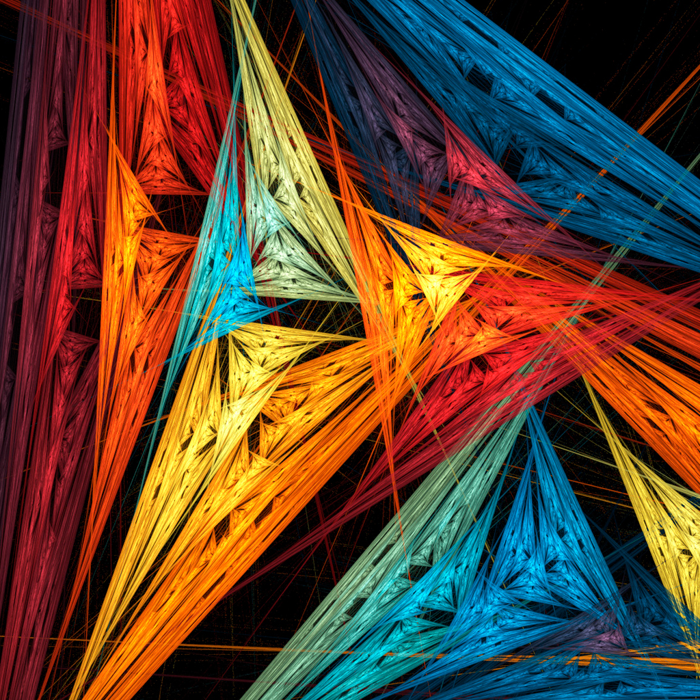
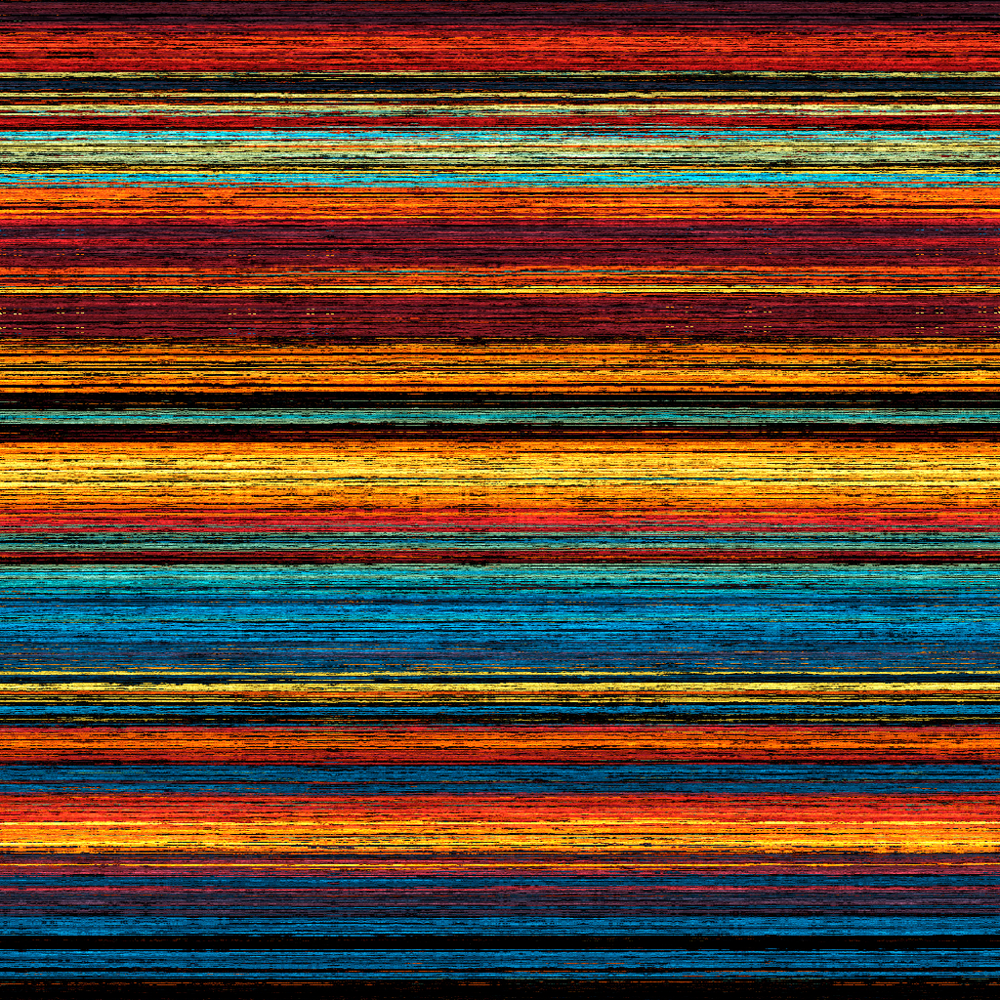

# Hilbert Photo Rearrangement

The code for this was designed to create art from existing images of sizes proportional to $2^n$.  
The result after applying the algorithm is an image with streaks of color representative of a region of the image.

## Color Lights :
Before | After
:-----:|:-----:
 | 